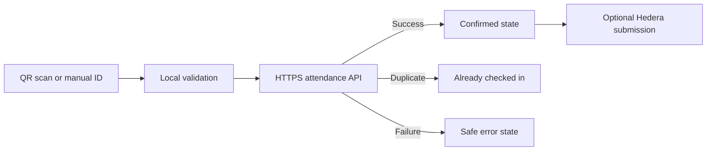

<div align="center">

# Event Check-in

**A secure, focused Android check-in station for event staff.**

Scan attendee QR codes, validate registrations through an HTTPS API, prevent accidental duplicate scans, and optionally create a tamper-evident attendance trail with Hedera Consensus Service.

[](https://github.com/mhmdwaelanwr/Events-Registration/actions/workflows/android.yml)
[](https://kotlinlang.org/)
[](https://developer.android.com/compose)
[](app/build.gradle.kts)
[](LICENSE)

[Design in Figma](https://www.figma.com/design/TjdQ3DeAUm0qbXhBLY1dDS/Events-Registration-%E2%80%94-Mobile-UI-UX?node-id=0-1) · [Security policy](SECURITY.md) · [Hedera reference](docs/HEDERA.md)

</div>

> [!IMPORTANT]
> This is an **organizer-facing attendance scanner**. It is not an event-discovery app, attendee registration portal, ticket wallet, or payment product.

## Product preview

| Staff access | QR scanner | Check-in confirmed | Station settings |
|:---:|:---:|:---:|:---:|
|  |  |  |  |

The interface follows a **Microsoft Fluent-inspired** visual system adapted for Android: Microsoft Blue `#0078D4`, neutral layered surfaces, compact 6–12 dp radii, subtle elevation, clear one-pixel borders, and system sans-serif typography.

## Why this project exists

Event entrances need a fast tool with one job: confirm whether a registration is valid and record attendance with minimal operator friction. Event Check-in keeps the camera, manual fallback, status feedback, and station settings in a small, predictable workflow designed for staff-operated devices.

## Features

- On-device QR and barcode detection using Google ML Kit.
- Camera lifecycle management through CameraX.
- Manual registration-ID entry as a scanning fallback.
- HTTPS attendance validation via `POST /attendance/mark`.
- Clear success, duplicate, validation, connection, and failure states.
- Three-second duplicate-scan debounce.
- Encrypted offline queue retried after authorized app start and the next successful online check-in.
- Input trimming, control-character rejection, and length validation.
- Staff access gate with local encrypted authorization state.
- System, light, and dark appearance preferences.
- Optional haptic feedback after check-in results.
- Optional Hedera testnet topic submission after a successful API response.
- Fluent-inspired Figma source and matching repository screenshots.

## How it works



The attendance API remains the source of truth. Hedera submission is optional and only runs when all required Hedera values are configured.

## Architecture

| Layer | Responsibility |
|---|---|
| Compose UI | Access gate, scanner, result dialogs, settings, and theme |
| `AttendanceViewModel` | UI state, validation, scan debounce, and orchestration |
| Retrofit service | Typed attendance requests and responses |
| OkHttp | HTTPS transport, timeouts, and platform certificate validation |
| CameraX + ML Kit | Preview lifecycle and barcode analysis |
| Settings storage | Dark-mode and haptic preferences |
| Security storage | Encrypted authorization state and runtime configuration |
| Offline queue | Up to 100 unique pending IDs stored encrypted and retried safely |
| Hedera adapter | Optional testnet topic-message submission |

## Technology

- Kotlin 2.0
- Jetpack Compose with Material 3 foundations
- Android Architecture Components and `StateFlow`
- Kotlin coroutines
- CameraX
- Google ML Kit Barcode Scanning
- Retrofit, OkHttp, and Gson
- AndroidX Security Crypto
- Hedera Java SDK and gRPC OkHttp transport
- Gradle version catalog and GitHub Actions

## Requirements

- Android Studio with JDK 17
- Android SDK 36
- Android 7.0 / API 24 or newer
- An HTTPS attendance API
- A physical camera for end-to-end scanning tests
- Optional Hedera testnet account and topic

## Configuration

Create a local `local.properties` file in the repository root:

```properties
sdk.dir=/path/to/Android/sdk

BASE_URL=https://api.example.com/
APP_ACCESS_KEY=development-only-key
REMOTE_CONFIG_URL=https://example.com/event-access-key.txt

# Optional — leave all three blank to disable Hedera submission
HEDERA_ACCOUNT_ID=
HEDERA_PRIVATE_KEY=
HEDERA_TOPIC_ID=
```

Never commit this file or real credentials.

### Attendance API contract

Request:

```http
POST /attendance/mark
Content-Type: application/json
```

```json
{
  "registrationId": "EVENT-2026-01842"
}
```

Successful response:

```json
{
  "success": true,
  "message": "Attendance marked successfully"
}
```

Return HTTP `409 Conflict`, or a clear duplicate message, when the attendee has already checked in.

## Build and verify

```bash
./gradlew testDebugUnitTest
./gradlew lintDebug
./gradlew assembleDebug
```

The same verification runs in [Android CI](https://github.com/mhmdwaelanwr/Events-Registration/actions/workflows/android.yml) on pushes to `master` or `main`, and on pull requests.

A production release must use a dedicated release signing configuration. The repository intentionally does not sign release builds with the debug certificate.

## Security model

The current client:

- uses Android's standard certificate and hostname verification;
- rejects non-HTTPS base URLs;
- disables cleartext traffic and Android backups;
- stores authorization state with encrypted preferences;
- validates registration identifiers before sending them;
- avoids exposing raw server errors to operators.

> [!WARNING]
> An APK cannot safely protect long-lived secrets. For a production deployment, move staff authorization and Hedera operator signing to a trusted backend. Give the Android app short-lived credentials and never publish a Hedera private key or permanent master access key inside a release APK.

Report vulnerabilities privately using [SECURITY.md](SECURITY.md).

## Project layout

```text
app/src/main/java/<application-package>/
├── MainActivity.kt                 # Compose app, scanner, access, and result UI
├── SecurityManager.kt              # Encrypted authorization and configuration
├── Hedera.kt                       # Optional HCS adapter
├── data/
│   ├── AttendanceModels.kt
│   └── SettingsPreferences.kt
├── network/
│   ├── AttendanceService.kt
│   └── RetrofitClient.kt
├── ui/
│   ├── SettingsScreen.kt
│   └── theme/
└── viewmodel/
    └── AttendanceViewModel.kt
```

Additional documentation and screenshots live under `docs/`.

## Known deployment boundary

The repository contains a working Android client architecture, but real event deployment still requires:

- a compatible production attendance API;
- server-side authentication and authorization;
- release signing and secure distribution;
- testing with the target Android camera hardware;
- a privacy and data-retention policy for real attendee identifiers.

## Contributing

Read [CONTRIBUTING.md](CONTRIBUTING.md), create a focused branch, include tests or verification notes, and open a pull request. Keep credentials, attendee data, generated APKs, and local environment files out of commits.

## License

Released under the [MIT License](LICENSE).

<div align="center">
Built and maintained by <a href="https://github.com/mhmdwaelanwr">Mohamed Anwar</a>.
</div>
