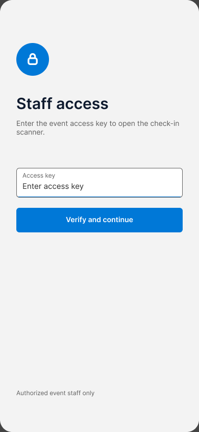
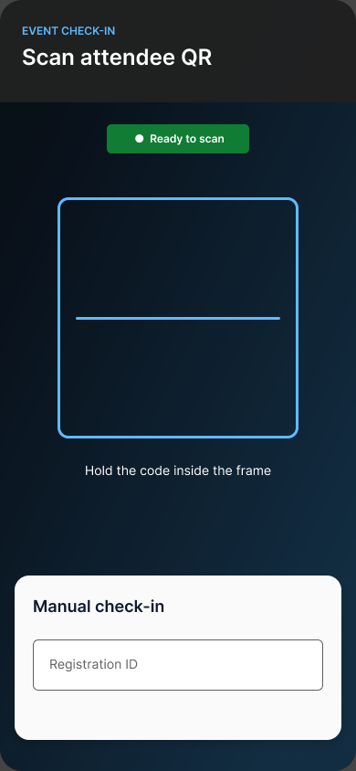
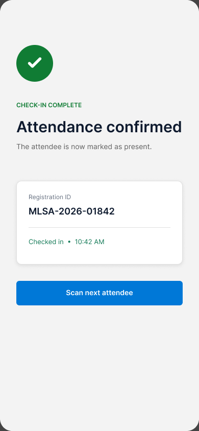
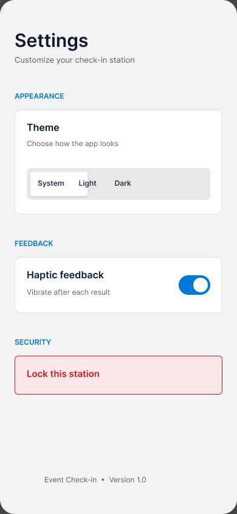

# Event Check-in for Android

A focused Android app for event staff to verify attendees at the door. It scans QR codes with CameraX and ML Kit, sends the registration ID to a configurable HTTPS attendance API, detects duplicate check-ins, and can optionally record successful IDs through Hedera Consensus Service.

The interface uses a Microsoft Fluent-inspired visual language adapted for Android: restrained radii, neutral layered surfaces, accessible borders, system sans-serif typography, and the Microsoft blue accent.

> This is an **organizer/staff check-in tool**. It is not an attendee event browser, ticket marketplace, account system, or registration portal.

## Screenshots

| Staff access | QR scanner | Confirmed | Settings |
|:--:|:--:|:--:|:--:|
|  |  |  |  |

The editable UI source is available in the [Figma design](https://www.figma.com/design/TjdQ3DeAUm0qbXhBLY1dDS/Events-Registration-%E2%80%94-Mobile-UI-UX?node-id=0-1).

## What it does

- Scans attendee QR codes on-device with ML Kit.
- Supports manual registration-ID entry when a code cannot be scanned.
- Marks attendance through `POST /attendance/mark`.
- Shows distinct success, duplicate, connection, and validation states.
- Debounces repeated scans of the same code.
- Supports light, dark, and system themes plus optional haptic feedback.
- Restricts entry to staff using a configured access key.
- Optionally submits successful registration IDs to a Hedera testnet topic.

## Tech stack

- Kotlin and Jetpack Compose
- MVVM with `StateFlow`
- CameraX and Google ML Kit barcode scanning
- Retrofit, OkHttp, Gson, and Kotlin coroutines
- AndroidX Security encrypted preferences
- Optional Hedera Java SDK integration

## Security notes

The app uses Android's standard certificate and hostname validation, rejects non-HTTPS API base URLs, disables cleartext traffic and Android backups, validates scanned IDs, and does not sign release builds with the debug key.

Secrets embedded in an APK can always be extracted. For production, keep Hedera operator keys and staff authorization on a trusted backend; the Android client should receive short-lived tokens and call server-side operations. Do not commit `local.properties`.

## Configuration

Create `local.properties` in the project root:

```properties
sdk.dir=/path/to/Android/sdk
BASE_URL=https://api.example.com/
APP_ACCESS_KEY=development-only-key
REMOTE_CONFIG_URL=https://example.com/event-access-key.txt

# Optional Hedera testnet integration
HEDERA_ACCOUNT_ID=
HEDERA_PRIVATE_KEY=
HEDERA_TOPIC_ID=
```

The attendance endpoint accepts `{ "registrationId": "MLSA-2026-01842" }` and returns `{ "success": true, "message": "Attendance marked successfully" }`. Use HTTP `409` or a duplicate/already-registered message for an attendee who has already checked in.

## Build and test

Requirements: Android Studio with JDK 17+, Android SDK 36, and a device/emulator running Android 7.0 (API 24) or newer.

```bash
./gradlew test
./gradlew lint
./gradlew assembleDebug
```

For a production release, configure your own release signing key; the repository intentionally does not fall back to the debug certificate.

## Project structure

- `MainActivity.kt` — Compose navigation, access gate, scanner, and result UI
- `AttendanceViewModel.kt` — state, validation, debouncing, and check-in orchestration
- `network/` — HTTPS API client and attendance endpoint
- `Hedera.kt` — optional Consensus Service submission
- `data/SettingsPreferences.kt` — appearance and haptic preferences
- `docs/screenshots/` — UI screenshots exported from the Figma source

## Contributing and security

See [CONTRIBUTING.md](CONTRIBUTING.md) before opening a pull request. Report vulnerabilities privately as described in [SECURITY.md](SECURITY.md).

Licensed under the [MIT License](LICENSE).
