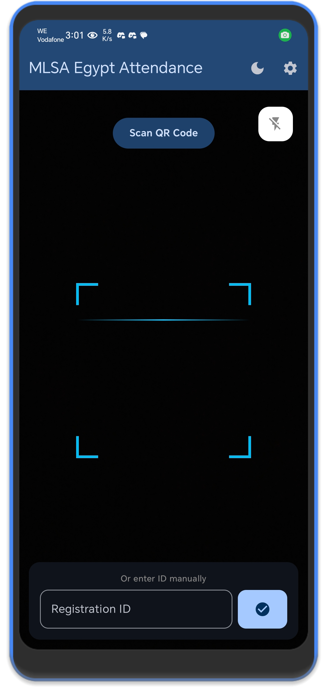
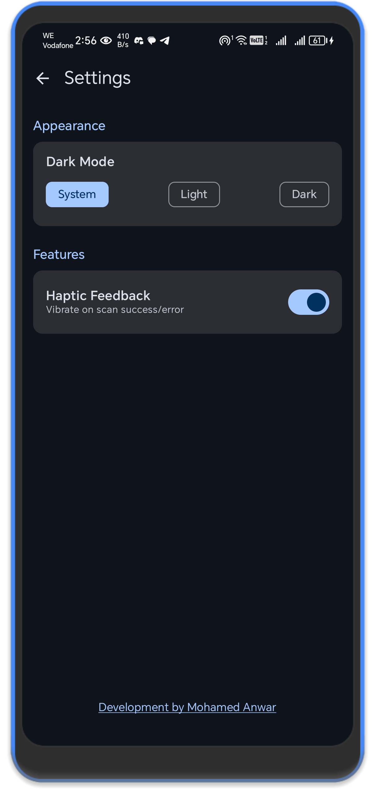
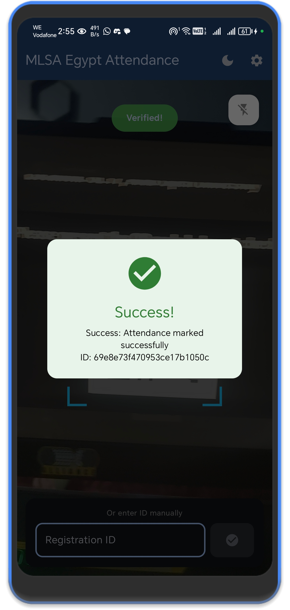

# Events Registration App

A comprehensive Android application designed to streamline the process of managing and registering for events. This app allows users to browse upcoming events, register for them, and manage their schedules efficiently.

## 📱 Features

*   **Event Browsing:** View a list of upcoming events with detailed descriptions, dates, and locations.
*   **User Registration:** Secure sign-up and login functionality for attendees.
*   **Easy Registration:** One-tap registration for events.
*   **My Tickets:** View registered events and access digital tickets.
*   **Profile Management:** Update user details and preferences.

## 🛠️ Tech Stack

*   **Language:** Kotlin / Java
*   **Architecture:** MVVM (Model-View-ViewModel)
*   **UI:** XML Layouts / Jetpack Compose
*   **Networking:** Retrofit / OkHttp
*   **Database:** Room Database / SQLite
*   **Asynchronous Programming:** Coroutines / RxJava
*   **Blockchain Integration:** Hedera

## 🔗 Hedera Integration

See [HEDERA](docs/HEDERA.md) for the Hedera Consensus Service workflow, configuration, and troubleshooting notes.

## 🚀 Getting Started

### Prerequisites

*   Android Studio Arctic Fox or newer
*   JDK 11 or newer
*   Android SDK API Level 21+

### Installation

1.  Clone the repository:
    ```bash
    git clone https://github.com/yourusername/events-registration.git
    ```
2.  Open the project in **Android Studio**.
3.  Sync the project with Gradle files.
4.  Create a virtual device or connect a physical device.
5.  Click **Run** (Shift+F10) to build and install the app.

## 📸 Screenshots

|                    Home Screen                     |           Settings Screen            | Registration |
|:--------------------------------------------------:|:------------------------------------:|:------------:|
|  |  |  |

## 🤝 Contributing

Contributions are welcome! Please follow these steps:

1.  Fork the project.
2.  Create your feature branch (`git checkout -b feature/AmazingFeature`).
3.  Commit your changes (`git commit -m 'Add some AmazingFeature'`).
4.  Push to the branch (`git push origin feature/AmazingFeature`).
5.  Open a Pull Request.

## 📄 License

This project is licensed under the MIT License - see the [LICENSE](LICENSE) file for details.

## 📞 Contact

**Mohamed Wael Anwar**  
*   **GitHub:** [github.com/mhmdwaelanwr](https://github.com/mhmdwaelanwr)

*   **Email:** [mhmdwaelanwr@gmail.com](mailto:mhmdwaelanwr@gmail.com) | [mhmdwaelanwr@outlook.com](mailto:mhmdwaelanwr@outlook.com)
*   **Phone:** +201010373387
*   **WhatsApp / Skype:** 01010412724

### Socials & Developer Profiles

**Handle: `@mhmdwaelanwr`**
*   **Dev:** GitLab, Google Dev, Gitea
*   **Social:** LinkedIn, Instagram, Facebook, YouTube, TikTok, Threads, Snapchat
*   **Chat/Media:** Discord, Twitch, Telegram, Spotify, Rave

**Handle: `@mhmdwaelanwar`**
*   Reddit, NGL, PayPal
